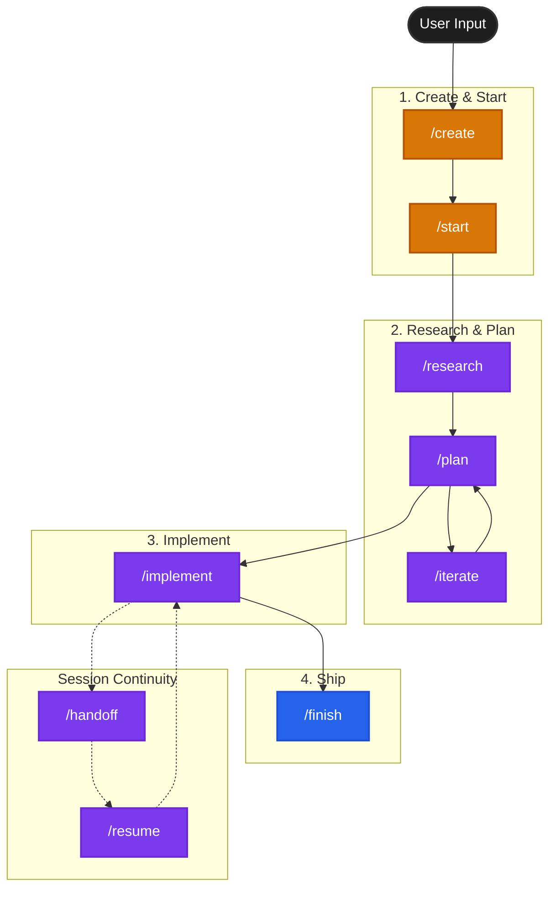

# OpenCode Agentic Workflow

```
  __  __                 _
 |  \/  |               | |
 | \  / | __ _  ___  ___| |_ _ __ ___
 | |\/| |/ _` |/ _ \/ __| __| '__/ _ \
 | |  | | (_| |  __/\__ \ |_| | | (_) |
 |_|  |_|\__,_|\___||___/\__|_|  \___/
           OpenCode Maestro
```

A structured, high-context workflow for [OpenCode](https://opencode.ai), aligned with [ACE-FCA](https://github.com/humanlayer/advanced-context-engineering-for-coding-agents) (Advanced Context Engineering - Frequent Intentional Compaction) and [Claude 4 Best Practices](https://platform.claude.com/docs/en/build-with-claude/prompt-engineering/claude-4-best-practices).

It utilizes **Beads** (Issue Tracking) and **Git Worktrees** to manage agent context and isolation.

## Philosophy

This workflow implements the **"Frequent Intentional Compaction"** methodology:

> "A bad line of code is a bad line of code. But a bad line of a **plan** could lead to hundreds of bad lines of code. And a bad line of **research** could land you with thousands of bad lines of code."

### Core Principles

1. **Human as Orchestrator** - You drive; agents execute
2. **Frequent Intentional Compaction** - Each phase is fresh context (subtask)
3. **Artifacts over Memory** - Persist to `.beads/artifacts/` (specs, research, plans)
4. **High-Leverage Human Review** - Review research and plans, not just code
5. **Research → Plan → Implement** - Mandatory sequence



## The 9-Command Workflow

```
/create                   →  Interview → bead + spec.md
      ↓
/start [bead-id]          →  bd ready → setup workspace → load context
      ↓
/research <bead-id>       →  Explore codebase → research.md
      ↓
   [Review research.md]   ←  HIGH LEVERAGE
      ↓
/plan <bead-id>           →  Create plan + testing strategy → plan.md
      ↓
   [Review plan.md]       ←  HIGH LEVERAGE
      ↓
/iterate <bead-id>        →  Update plan based on feedback (optional)
      ↓
/implement <bead-id>      →  Execute plan + write tests
      ↓
   [Tests + Lint MUST pass] ← HARD GATE
      ↓
/finish                   →  Verify gate → commit + sync

Session Continuity:
──────────────────────────────────
/handoff <bead-id>        →  Create handoff document (context approaching limit)
/resume <bead-id>         →  Resume from latest handoff (new session)
```

### Completion Gates (Non-Negotiable)

A bead **CANNOT** be marked complete until:
- Build passes
- **ALL** tests pass (existing + new)
- Lint passes (if present)
- All tests specified in plan's "Testing Strategy" are written

## The Stack

- **[OpenCode](https://opencode.ai)**: The AI Coding Agent
- **[Beads (bd)](https://github.com/beads-dev/beads)**: Lightweight, CLI-first issue tracking that lives in git
- **[HumanLayer](https://github.com/humanlayer/humanlayer)**: Creators of the "Context Engineering" and "12-Factor Agent" methodologies

## Installation

Run this command in the root of your project:

```bash
# Local install (current directory)
/bin/bash -c "$(curl -fsSL https://raw.githubusercontent.com/DorelRoata/opencode-maestro/main/install.sh)"

# Global install (for all projects)
/bin/bash -c "$(curl -fsSL https://raw.githubusercontent.com/DorelRoata/opencode-maestro/main/install.sh)" -- -g

# Show help
./install.sh --help
```

### Windows (PowerShell)

```powershell
# Clone and install locally
git clone https://github.com/DorelRoata/opencode-maestro.git
cd opencode-maestro
# Then open Git Bash and run: ./install.sh
```

**For forks**: The install script auto-detects your GitHub user/repo from `git remote origin`, so forked repos work automatically.

## What it installs

### Slash Commands (`.opencode/command/`)

| Command | Purpose |
|---------|---------|
| `/create` | Interview → bead + spec.md |
| `/start [bead-id]` | Find/setup bead, load context |
| `/research <bead-id>` | Deep codebase exploration → research.md |
| `/plan <bead-id>` | Interactive planning → plan.md |
| `/iterate <bead-id>` | Update existing plan based on feedback |
| `/implement <bead-id>` | Execute plan step-by-step |
| `/finish [bead-id]` | Review + commit + sync + push |
| `/handoff <bead-id>` | Create handoff for session continuity |
| `/resume <bead-id>` | Resume from latest handoff |

### Subagents (`.opencode/agent/`)

| Agent | Model | Purpose |
|-------|-------|---------|
| `codebase-locator` | haiku | Fast file/component finding |
| `codebase-analyzer` | opus | Deep code understanding with file:line refs |
| `codebase-pattern-finder` | opus | Find similar implementations to model after |
| `code-reviewer` | opus | Review for bugs, security, performance, conventions |
| `test-writer` | opus | Generate tests following codebase patterns |
| `commit-message-writer` | haiku | Craft conventional commit messages |
| `web-search-researcher` | haiku | Analyze content from URLs |

All agents use explicit permission controls (`permission: { bash: deny, edit: deny }`) for safety.

### Protocols

- `AGENTIC_WORKFLOW.md`: The master protocol document

## Usage

1. **Start**: `opencode`
2. **Create Work**: `/create` (interview → bead + spec)
3. **Pick Work**: `/start` (or `/start bd-xxx` for specific bead)
4. **Deep Work**: The agent guides you through `/research` → `/plan` → `/implement`
5. **Ship**: `/finish` (commits, syncs beads, pushes)

### Session Continuity

When context window approaches limit:
1. Run `/handoff <bead-id>` to capture current state
2. End session gracefully  
3. Start new session with `/resume <bead-id>`
4. Continue work seamlessly from handoff

## Human Review Points

| After | Review | Why |
|-------|--------|-----|
| `/create` | `spec.md` | Ensure problem is well-defined |
| `/research` | `research.md` | Bad research = bad plan = bad code |
| `/plan` | `plan.md` | Approve approach before implementation |
| `/finish` | Commits + PR | Final validation |

## Artifacts

```
.beads/
└── artifacts/
    └── <bead-id>/
        ├── spec.md       # Created by /create
        ├── research.md   # Created by /research
        ├── plan.md       # Created by /plan
        ├── review.md     # Created by /finish
        └── handoffs/     # Session continuity
            └── YYYY-MM-DD_HH-MM-SS_handoff.md
```
