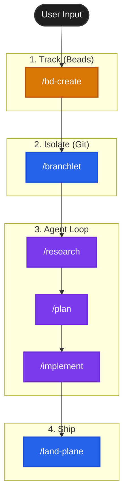

# OpenCode Agentic Workflow

```
  __  __                       _
 |  \/  |                     | |
 | \  / | __ _  ___  ___| |_ _ __ ___
 | |\/| |/ _` |/ _ \/ __| __| '__/ _ \
 | |  | | (_| |  __/\__ \ |_| | | (_) |
 |_|  |_|\__,_|\___||___/\__|_|  \___/
           OpenCode Maestro
```

A structured, high-context workflow for [OpenCode](https://opencode.ai), ported from [Amp Maestro](https://github.com/lleewwiiss/amp-maestro).

It utilizes **Beads** (Issue Tracking) and **Branchlet** (Worktrees) to manage agent context and isolation.

## Philosophy

This workflow implements the **"Frequent Intentional Compaction"** methodology championed by HumanLayer.



It enforces a structured process:

1. **Research**: Understand the problem deeply before touching code.
2. **Plan**: Create a detailed, architectural plan (with Oracle reasoning).
3. **Manager/Worker**: The main agent acts as a manager, spawning sub-agents for implementation to keep context clean.
4. **Compaction**: Regularly summarizing work into durable artifacts (`research.md`, `plan.md`) to prevent context window pollution.
5. **Artifacts over Memory**: Using the filesystem (`.beads/artifacts/`) as long-term memory, linked to Issues (`bd`).

## The Stack

- **[OpenCode](https://opencode.ai)**: The AI Coding Agent.
- **[Beads (bd)](https://github.com/beads-dev/beads)**: Lightweight, CLI-first issue tracking that lives in git.
- **[Branchlet](https://github.com/raghavpillai/branchlet)**: Git worktree manager for isolated agent environments.
- **[HumanLayer](https://github.com/humanlayer/humanlayer)**: Creators of the "Context Engineering" and "12-Factor Agent" methodologies this workflow is based on.

## Installation

Run this command in the root of your project:

```bash
# Local install (current directory)
/bin/bash -c "$(curl -fsSL https://raw.githubusercontent.com/lleewwiiss/opencode-maestro/main/install.sh)"

# Global install (for all projects)
/bin/bash -c "$(curl -fsSL https://raw.githubusercontent.com/lleewwiiss/opencode-maestro/main/install.sh)" -- -g
```

## What it installs

1. **Slash Commands** (`.opencode/command/`):
   - `/architect`: Visualize and document system architecture (ADRs, Diagrams).
   - `/bd-create`: Interview-first issue creation.
   - `/bd-next`: Pick tasks and auto-spawn worktrees.
   - `/bd-onboard`: Onboard existing issues into the workflow.
   - `/bead-notes`: Manage notes for a specific bead.
   - `/branchlet-from-bead`: Create a worktree from an existing bead.
   - `/context`: Load full bead context (artifacts, session notes).
   - `/kb-build`: Build/update shared repository knowledge.
   - `/research`: Deep context gathering (Librarian/Subagent).
   - `/plan`: Oracle-powered implementation planning.
   - `/implement`: Manager/Worker implementation loop.
   - `/review`: Verify implementation against plan.
   - `/spec`: Create detailed specifications before research.
   - `/split`: Break down large tasks into smaller subtasks.
   - `/land-plane`: Final pre-merge checklist.

2. **Protocols**:
   - `AGENTIC_WORKFLOW.md`: The master protocol document.

## Usage

1. **Start**: `opencode`
2. **Pick Work**: `/bd-next` (or `/bd-create` for new ideas).
3. **Deep Work**: The agent will guide you through `/research` -> `/plan` -> `/implement`.
    - **Important**: Start a new OpenCode session after each command to ensure clean context if necessary, though subtasks handle most of this.
